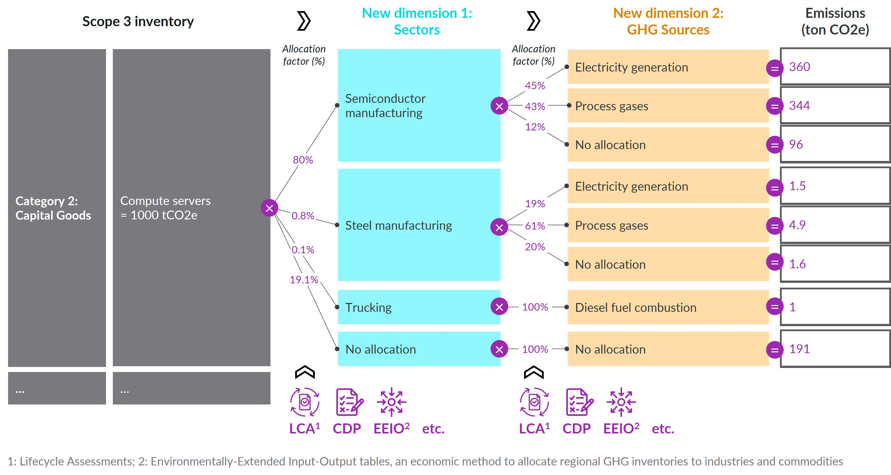
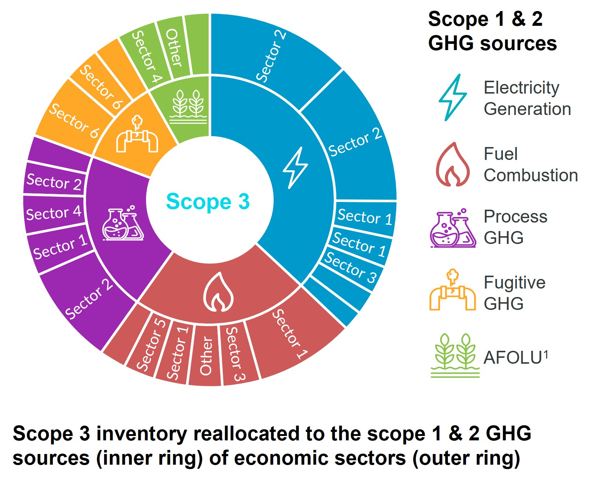

# USEEIO Disaggregation & Allocation Factors

This repository provides a simple, reproducible workflow to generate a tiered and scope-partitioned Supply Chain Emission Factors (SEF) table from USEEIO. It disaggregates each commodity’s total GHG intensity into:

- Tiers: Tier 1 (your organization's direct supplying sectors), Tier 2 (Tier 1's direct supplying sectors), Tier 3+ (all upstream)
- Scopes: Scope 1 and Scope 2

The main output is an Excel workbook and a CSV with absolute and relative contributions by embedded sector, tier, and scope.

## Just here for the data? (no coding required)

### Interactive visual

- Try the interactive sunburst built from the CSV in this repo: https://open.decarbnexus.com/
- It lets you pick a commodity and explores Economic tiers (1/2/3+) → Scopes (1/2) → Sectors as a sunburst using Relative_Contribution values.

### Data tables

Download the latest files from the v1.0 release:

- **Excel** (all-in-one workbook): `SEF_<version>_disaggregation_factors_GHG<year>_IO<year>.xlsx`
- **CSV** (flat tables): `csv/`
  - Main contributions: `SEF_<version>_disaggregation_factors_GHG<year>_IO<year>.csv`
  - Electricity-only: `SEF_<version>_disaggregation_factors_GHG<year>_IO<year>_electricity_only.csv`
  - Sector classification: `sector_classification.csv`
- **Parquet** (columnar, data science): `parquet/`
  - Main contributions + sector classification
- **JSON** (hierarchical): `json/`
  - Main contributions (nested: commodity > tier > sector > scope) + sector classification
- **JSON-LD** (RDF-ready): `jsonld/`
  - Main contributions + sector classification with `@context` vocabularies

Open Excel files in your spreadsheet tool or start with the "Contributions_by_Name" tab for human-readable industry names.

#### Format guide

- **Excel/CSV**: Flat tables, best for spreadsheet users and simple imports.
- **Parquet**: Snappy-compressed columnar format; optimized for pandas, Polars, DuckDB, Apache Spark. ~10× faster reads than CSV.
- **JSON**: Nested hierarchy (`commodity > tier > sector > scope`); ideal for web APIs, JavaScript/Python data science pipelines.
- **JSON-LD**: RDF-ready with `@context` vocabulary; can be ingested into triple stores (Apache Jena, RDF4J) or converted to Turtle/N-Triples for knowledge graphs.

What’s inside (high level):
- Contributions by Tier and Scope show how much each upstream sector contributes to the chosen commodity’s GHG intensity.
- “Absolute contribution” columns are intensities (kgCO2e per USD of the embedded commodity, in the specified IO year).
- “Relative contribution” shows the percentage split across all contributing sectors for a given commodity (sums to 100%).
- The "sector_classification" tab provides category, subcategory, and descriptions to understand each sector.

### Use

For context on how these contributions help translate Scope 3 inventories into actionable drivers, see the AIM Platform's article "What Is Deep Value Chain Analysis, and How Can It Scale Corporate Decarbonization Investments?": https://aimplatform.org/what-is-deep-value-chain-analysis-and-how-can-it-scale-corporate-decarbonization-investments/. This dataset helps you:
- Identify hotspots by sector and upstream tier
- Separate Scope 1 vs Scope 2 contributions for better prioritization
- Connect your organization's demand and supply within the economy to specific GHG sources
- Conduct hybrid EEIO accounting under the GHG Protocol (see Example 1.3): https://ghgprotocol.org/sites/default/files/2023-03/Scope3_Calculation_Guidance_0%5B1%5D.pdf. Learn more at https://tasaanalytics.com/hybrid-path-methodology/

## Quick start (to reproduce the data)

1) Install R (≥ 4.2) and RTools (Windows). Optional but recommended: RStudio.
2) Clone or download this repository.
3) Edit `config.yml` (see below) if you want to change the SEF version or Scope 2 sectors.
4) Run the analysis (no Pandoc required):
  - Option A – script (recommended):
    ```r
    source("scripts/run_analysis.R")
    ```
    This extracts the code from the Rmd and runs it end‑to‑end, writing Excel/CSVs to `outputs/`.
  - Option B – interactive: open `analysis/generate_scope3_disaggregation_table_tier1_2_3+.Rmd` and "Run All Chunks" to see results at each step; outputs still go to `outputs/`.

5) Optional: “Knit” (aka render an HTML/PDF document of the Rmd). Knitting uses `rmarkdown::render()` which requires Pandoc. RStudio bundles Pandoc; otherwise install it from https://pandoc.org/installing.html. Knitting is not required to produce the Excel/CSV outputs.

Artifacts will be saved under `outputs/` and are committed to the repo so non-technical users can download them directly.

## Requirements

This workflow installs packages on first run. At minimum, you'll need:

- Internet access (to install packages and download model specs)
- R packages: pacman, yaml, dplyr, reshape2, knitr, httr, openxlsx, stringr, tidyr, cli, devtools, useeior, arrow (for Parquet), jsonlite (for JSON/JSON-LD)
- Pandoc only if you want to "Knit"/render a document (RStudio bundles it; otherwise install separately)

The R Markdown takes care of installing `devtools`/`useeior` versions that match your selected SEF version.

## Configuration (`config.yml`)

Example in `config.yml`:

```yaml
sef_version: "v1.3.0"

# List of sectors considered as Scope 2 (utilities), using USEEIO codes
scope_2_sectors:
  - "221100/US"
```

- `sef_version`: Supply Chain Emission Factors (SEF) release to reproduce. The script will automatically fetch the matching USEEIO model/spec and correct `useeior` package version.
- `scope_2_sectors`: Sectors whose direct emissions you want treated as Scope 2. You can add more codes as needed.

## Project structure

- `analysis/generate_scope3_disaggregation_table_tier1_2_3+.Rmd` – Main analysis; builds model, runs decomposition, and exports outputs
- `config.yml` – User configuration (version and Scope 2 sectors). Edit this.
- `spec_files/` – USEEIO model spec files (downloaded or stored)
- `scripts/run_analysis.R` – Run the analysis without Pandoc; writes Excel/CSV to `outputs/`
- `outputs/` – Rendered outputs (Excel/CSV) ready for end users
- `local/` – Your scratch area; ignored by Git

## How to use the outputs (practical guide)

1) Open the Excel file in `outputs/`.
2) Go to the "Contributions_by_Name" tab (easier for beginners) or "Contributions_by_Code" if you work with codes.
3) Find your commodity (the product or service you spend on) in the Disaggregated_Commodity columns.
4) Use "Relative_Contribution" to disaggregate your total emissions: multiply your commodity's total emissions by the "Relative_Contribution" values to identify and surface the largest upstream drivers.
5) Use the "Tier" field to see whether impacts are direct (Tier 1), from immediate suppliers (Tier 2), or further upstream (Tier 3+).
6) Use the "Scope" field to distinguish Scope 1 vs Scope 2 drivers.
7) For deeper context on what a sector represents and how it is classified, check the "sector_classification" tab.

Deeper dive (EEIO data): The workbook also includes underlying EEIO data to support advanced analysis:
- Direct GHG impacts vector (`d_GHG`) – per‑sector direct intensity; can be diagonalized to `D` if needed
- Direct requirements matrix (`A`)
- Leontief inverse (`L`)

These sheets let you reproduce or extend the decomposition, inspect technical coefficients, and verify totals.

Additional reading and context:
- Deep Value Chain Analysis and scaling corporate decarbonization investments (AIM Platform): https://aimplatform.org/what-is-deep-value-chain-analysis-and-how-can-it-scale-corporate-decarbonization-investments/
- AIM Platform Association Test (draft guidance): https://aimplatform.org/standard-development/aim-platform-association-test/
- Hybrid EEIO accounting under the GHG Protocol (see Example 1.3): https://ghgprotocol.org/sites/default/files/2023-03/Scope3_Calculation_Guidance_0%5B1%5D.pdf
- Hybrid Path Methodology by Tasa Analytics: https://tasaanalytics.com/hybrid-path-methodology/

## Limitations & planned development
1) Margins not yet included
  - The current datasets disaggregate only the Supply Chain Emission Factors (SEF) portion and do not split retail/wholesale/transport margins.
  - If your emission factors include margins, apply these disaggregation shares only to the SEF component. A future release may add margin disaggregation.

2) Model scope and EEIO caveats
  - USEEIO is an aggregate, economy‑wide model with typical EEIO assumptions (e.g., industry homogeneity, proportionality, domestic technology). For methods and limitations, see Ingwersen et al. (2022): https://www.nature.com/articles/s41597-022-01293-7

3) Scope 1/2 mapping differences vs corporate GHG accounting
  - Leased assets: Corporate inventories often record the lessee’s (tenant’s) Scope 1 and 2. Here, these emissions are attributed to the asset’s sector (the lessor). Planned: an option to reassign them to purchasers’ Scope 1/2.
  - Electricity Scope 2:
    - All direct emissions from the electricity sector are currently included, covering both generation and emissions from transmission & distribution (T&D), such as SF6.
    - This approach can make Scope 2 approximately 1% higher than typical corporate methods.
    - **Planned:** Options to isolate generation-only emissions and treat T&D separately.
    - **Notes:**
      - Generation losses from T&D are reported under the Scope 1 of the embedded electricity sector.
      - Upstream fuel-related emissions are reported under the Scope 1 & 2 of the embedded sectors in the fuel supply chains.

4) Disaggregation options
  - **Commodity-level purchases:** This workflow disaggregates emissions into the Scope 1 and Scope 2 components of sectors only. It does not provide totals for the actual commodities purchased within those supplier sectors. In other words, you cannot see the total emissions of specific commodities purchased from sectors in each tier. We plan to enable this option in a future update.
  - **Tier linkages:** For simplicity and to limit file sizes, linkages between Tier 2 and Tier 3+ are not retained in the standard outputs. Only connections between Tier 1 and Tier 2 or between Tier 1 and Tier 3+ are preserved. We plan to enable this option in a future update.
  - **Tier 3+ granularity:** The Tier 3+ group is not disaggregated into individual tiers (Tier 3, Tier 4, etc.). We found this additional granularity to have limited practical use for most applications and do not plan to disaggregate it further in the standard outputs.

Advanced users can obtain more granular results (such as commodity-level totals, detailed tier linkages, or a full Tier 3+ decomposition) by modifying the R code, provided they have a working knowledge of EEIO theory.

We welcome feedback on which features to prioritize for future releases. Please open a thread in the repository's Discussions to share your thoughts on what would be most useful.

## Beginner setup: getting R running (no prior coding experience)

Windows (recommended simplest path):
1) Install R: https://cran.r-project.org/bin/windows/base/
2) Install RTools (compile support): https://cran.r-project.org/bin/windows/Rtools/
3) Install RStudio (optional but easier): https://posit.co/download/rstudio-desktop/
4) Download/clone this repository and open it in RStudio (double-click the `.Rproj` file or use File > Open Project).
5) To run without Pandoc: either `source("scripts/run_analysis.R")` or open the Rmd and use "Run All Chunks". Both write Excel/CSV to `outputs/`.
6) Optional Knitting: If you want a rendered HTML/PDF document, use the Knit button or `rmarkdown::render(...)`. This requires Pandoc (bundled with RStudio; otherwise install from pandoc.org). Not needed for the outputs.

macOS:
1) Install R: https://cran.r-project.org/bin/macosx/
2) (Optional) Install Xcode Command Line Tools if prompted.
3) Install RStudio: https://posit.co/download/rstudio-desktop/
4) Open the project in RStudio. To run without Pandoc: `source("scripts/run_analysis.R")` or "Run All Chunks" in the Rmd. Optional: Use Knit/render if you want a document (requires Pandoc).

If you don’t want to install anything, you can still download the pre-built files directly from the `outputs/` folder on GitHub.

## Troubleshooting

- Pandoc error while knitting: you don’t need to knit to produce outputs. Use `source("scripts/run_analysis.R")` or "Run All Chunks". If you do want to knit, install Pandoc (RStudio bundles it).
- If you encounter issues with Rscript or PATH: open RStudio and use the script or run chunks interactively.
- Network/timeout errors when downloading specs: check connectivity/proxy and re-run.
- Package install issues: try `install.packages("pacman")` in R, then re-run the script.

## Feedback, questions, and feature requests

We’re learning with you. Please use the repository’s Discussions tab to ask questions, request features, or share how you’re using the data.

Peer review status

We aim to have this workflow and its outputs peer-reviewed over the next few months. If you’re interested in participating in the review or testing the methods on your data, please open a Discussion or contact us via the repository.

## License
- Code: See `LICENSE`.
- Data (files under `outputs/` and data attached to GitHub releases): CC BY 4.0. See `LICENSE-DATA.md` and https://creativecommons.org/licenses/by/4.0/.

## Credits and acknowledgement

Huge thanks to the USEPA and Cornerstone teams and contributors whose work powers this project:
- USEEIO package and models: https://github.com/USEPA/useeior/
- Supply Chain Emission Factors: https://github.com/USEPA/supply-chain-factors
- FLOWSA: https://github.com/USEPA/flowsa

Project by Damien Lieber @ [DecarbNexus LLC](https://decarbnexus.com).

## Pair this with GHG source disaggregation

This project focuses on disaggregating Scope 3 emissions by USEEIO sectors (and tiers). You’ll soon be able to combine it with a companion workflow that disaggregates each sector’s emissions into their underlying greenhouse gas sources:

- Upcoming repository: https://github.com/DecarbNexus/useeio_ghg_sources_disaggregation (target publication by Thanksgiving 2025)
- Data foundation: It leverages USEPA’s FLOWSA (https://github.com/USEPA/flowsa), which is also a core data source for USEEIO. Pairing the two lets you go from “which sectors and tiers?” to “which GHG sources within those sectors?”

GHG source disaggregation completes the DecarbNexus primary disaggregation workflow using USEEIO data, as illustrated below.


When used together, you can produce visuals like the sunburst below, which organize Scope 3 in the intuitive language of Scope 1 & 2 - by sector and source.
<p>
  
  
</p>
